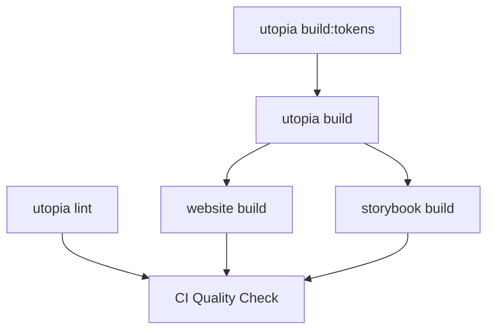

# 🚀 Turborepo Integration

Ce monorepo utilise **Turborepo** pour optimiser les builds, le caching et l'orchestration des tâches.

## ✨ Avantages

### 🚄 **Performance**
- **Cache intelligent** : Ne rebuild que ce qui a changé
- **Parallélisation** : Exécute les tâches en parallèle quand possible
- **Incremental builds** : Détection automatique des changements

### 🎯 **Simplicité**
- Scripts unifiés sans `cd` manuel
- Gestion automatique des dépendances entre packages
- Configuration centralisée dans `turbo.json`

### 📊 **Observabilité**
- Métriques de performance des builds
- Logs structurés et clairs
- Timeline des exécutions

## 🔧 Configuration

### **turbo.json**
```json
{
  "tasks": {
    "build": {
      "dependsOn": ["^build"],        // Build les dépendances d'abord
      "outputs": ["dist/**"]          // Cache basé sur ces outputs
    },
    "dev": {
      "dependsOn": ["^build"],        // Website dépend d'Utopia built
      "cache": false,                 // Dev mode pas mis en cache
      "persistent": true              // Process qui reste ouvert
    }
  }
}
```

## 📋 Commandes

### **Développement**
```bash
# Lance tous les dev servers avec hot reload
npm run dev

# Lance seulement le website (build Utopia automatiquement)
turbo dev --filter=utopia-website

# Lance seulement Utopia
turbo dev --filter=@club-employes/utopia
```

### **Build**
```bash
# Build tout le monorepo
npm run build

# Build seulement le website (+ ses dépendances)
turbo build --filter=utopia-website

# Build seulement Utopia
turbo build --filter=@club-employes/utopia

# Build incrémental (utilise le cache)
turbo build --filter=...   # Seulement les packages modifiés
```

### **Qualité**
```bash
# Lint tout
npm run lint

# Type check tout
npm run type-check

# Seulement les packages modifiés depuis HEAD
turbo lint --filter=...[HEAD^1]
```

### **Cache**
```bash
# Voir les stats du cache
turbo build --summarize

# Nettoyer le cache
npm run clean

# Build avec cache force skip (debug)
turbo build --force
```

## 🎯 Filtres Turborepo

### **Par nom de package**
```bash
turbo build --filter=@club-employes/utopia
turbo build --filter=utopia-website
turbo build --filter=storybook
```

### **Par dépendances**
```bash
# Website + toutes ses dépendances
turbo build --filter=utopia-website --include-dependencies

# Tous les packages qui dépendent d'Utopia
turbo build --filter=...@club-employes/utopia
```

### **Par changements Git**
```bash
# Seulement les packages modifiés depuis main
turbo lint --filter=...[origin/main]

# Seulement les packages modifiés dans ce commit
turbo test --filter=...[HEAD^1]
```

## 🔄 Workflow avec Turborepo

### **1. Développement local**
```bash
# 1. Installer les dépendances
npm ci

# 2. Développer (tout en parallèle)
npm run dev

# 3. Build incrémental
npm run build
```

### **2. CI/CD optimisé**
```yaml
# .github/workflows/website.yml
- name: 🏗️ Build website with dependencies  
  run: turbo build --filter=utopia-website --include-dependencies
```

**Avantages** :
- ✅ **1 commande** au lieu de 5+ étapes manuelles
- ✅ **Cache GitHub Actions** via Turborepo Remote Cache
- ✅ **Builds parallèles** automatiques
- ✅ **Skip si pas de changements**

### **3. Dépendances automatiques**


Turborepo orchestre automatiquement :
1. **build:tokens** → **build** pour Utopia
2. **build Utopia** → **build Website/Storybook**
3. **Parallélisation** intelligente quand possible

## 📈 Métriques Performance

### **Avant Turborepo**
```bash
# Build complet à chaque fois
npm run build:tokens  # 15s
npm run build         # 30s  
cd website && npm run build  # 25s
Total: ~70s
```

### **Avec Turborepo**
```bash
# Premier build
turbo build  # 70s (même temps)

# Build incrémental (rien changé)
turbo build  # ~2s (cache hit)

# Build partiel (seulement website modifié)
turbo build --filter=utopia-website  # ~25s (skip utopia)
```

## 🎯 Remote Cache (Optionnel)

Pour accélérer encore plus les builds sur CI/CD :

```bash
# Activer Vercel Remote Cache (gratuit pour open source)
npx turbo login
npx turbo link
```

**Résultat** : Les builds CI partagent le cache entre eux !

## 🚀 Migration terminée

Toutes les commandes sont maintenant optimisées :
- ✅ **Scripts simplifiés** dans `package.json`
- ✅ **Workflows GitHub** optimisés 
- ✅ **Hot reload** amélioré en dev
- ✅ **Builds incrémentaux** 
- ✅ **Cache intelligent**

**Prêt à gagner en performance ! 🎉**