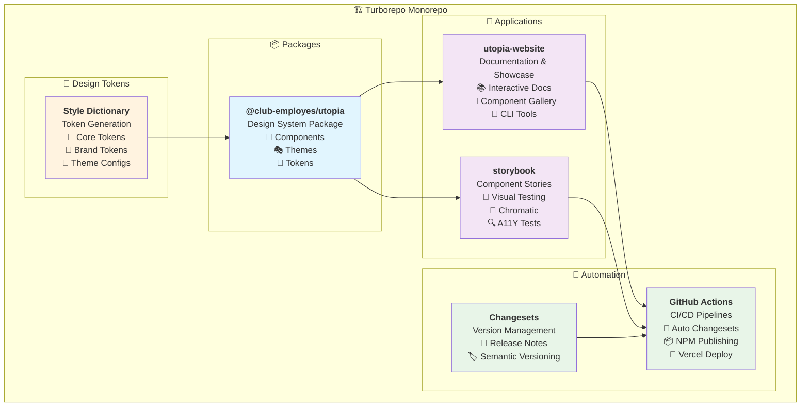
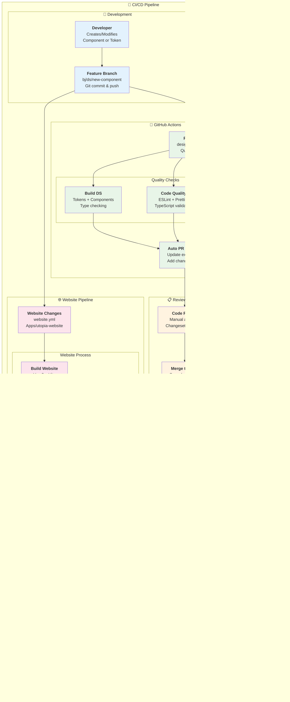

# 📚 Documentation Complète - Design System Utopia

Documentation technique complète du monorepo Design System Utopia de Club Employés. Cette documentation couvre l'architecture, les processus, les outils et les workflows pour les développeurs rejoignant le projet.

## 🎯 Vue d'ensemble

Le Design System Utopia est un monorepo Turborepo moderne qui fournit :
- 🎨 **Design System complet** - Composants Vue 3, tokens, thèmes
- 🌐 **Application de documentation** - Showcase interactif
- 📖 **Storybook** - Tests visuels et documentation
- 🤖 **CI/CD automatisé** - GitHub Actions, Changesets, NPM
- 🔧 **Outils de développement** - CLI, générateurs, validateurs

## 📋 Table des matières

- [🏗️ Architecture du Monorepo](#️-architecture-du-monorepo)
- [📦 Projets et Packages](#-projets-et-packages)
- [🎨 Design Tokens](#-design-tokens)
- [🧩 Composants](#-composants)
- [🤖 CI/CD et Automatisation](#-cicd-et-automatisation)
- [🔧 Outils CLI](#-outils-cli)
- [🚀 Guide de Démarrage](#-guide-de-démarrage)
- [🛠️ Développement](#️-développement)
- [📖 Documentation par Projet](#-documentation-par-projet)

## 🏗️ Architecture du Monorepo

Le projet utilise **Turborepo** pour gérer efficacement un monorepo avec plusieurs packages et applications interdépendants.



### Structure des dossiers

```
DS/
├── packages/
│   └── utopia/                 # 📦 Design System Package
├── apps/
│   ├── utopia-website/         # 🌐 Documentation Website
│   └── storybook/              # 📖 Storybook App
├── .github/
│   ├── workflows/              # 🤖 GitHub Actions
│   └── actions/                # 🔧 Custom Actions
├── .changeset/                 # 📝 Changesets Config
├── scripts/                    # 🛠️ Utility Scripts
└── docs/                       # 📚 Documentation
```

## 📦 Projets et Packages

### 🎨 @club-employes/utopia (Package Principal)

**Localisation** : `packages/utopia/`  
**Type** : Package NPM public  
**Version** : 2.14.0  

Le cœur du design system contenant :
- **Composants Vue 3** - Atoms, Molecules, Organisms, Layouts
- **Design Tokens** - Couleurs, espacement, typographie
- **Thèmes multi-marques** - Club Employés & Gifteo (light/dark)
- **Composables** - Hooks Vue 3 réutilisables
- **Types TypeScript** - Définitions complètes

**📖 [Documentation détaillée](../packages/utopia/README.md)**

### 🌐 Utopia Website (Application de Documentation)

**Localisation** : `apps/utopia-website/`  
**Type** : Application Vue 3 privée  
**URL** : https://ds-utopia.vercel.app/

Application de documentation interactive avec :
- **Showcase des composants** - Exemples et démonstrations
- **Documentation des tokens** - Guide complet des design tokens
- **Outils CLI intégrés** - Générateurs de composants et pages
- **Navigation dynamique** - Menu généré automatiquement

**📖 [Documentation détaillée](../apps/utopia-website/README.md)**

### 📖 Storybook (Tests Visuels)

**Localisation** : `apps/storybook/`  
**Type** : Application Storybook privée  
**URL** : Déployé via Chromatic

Application pour les tests visuels avec :
- **Stories interactives** - Tous les composants documentés
- **Tests de régression** - Chromatic pour détecter les changements
- **Tests d'accessibilité** - Validation WCAG automatique
- **Documentation technique** - Props, variants, exemples

**📖 [Documentation détaillée](../apps/storybook/README.md)**

## 🎨 Design Tokens

Le système de design tokens utilise **Style Dictionary** pour générer des tokens CSS et JavaScript à partir de fichiers JSON source.

```mermaid
flowchart TD
    subgraph "🎨 Design Tokens Architecture"
        subgraph "📁 Core Tokens"
            COLORS["`**colors.json**<br/>Base color palette<br/>Neutral, Brand, Semantic`"]
            SPACING["`**spacing.json**<br/>Spacing scale<br/>xs, sm, md, lg, xl`"]
            TYPO["`**typography.json**<br/>Font families, sizes<br/>Weights, line-heights`"]
            BORDERS["`**borders.json**<br/>Border radius<br/>Border widths`"]
            SHADOWS["`**shadows.json**<br/>Box shadows<br/>Elevation levels`"]
        end
        
        subgraph "🏢 Brand Tokens"
            CE_LIGHT["`**club-employes/colors.json**<br/>Light theme colors<br/>Primary, Secondary`"]
            CE_DARK["`**club-employes/colors-dark.json**<br/>Dark theme colors<br/>Adapted contrast`"]
            GF_LIGHT["`**gifteo/colors.json**<br/>Gifteo light colors<br/>Brand specific`"]
            GF_DARK["`**gifteo/colors-dark.json**<br/>Gifteo dark colors<br/>Brand specific`"]
        end
        
        subgraph "🌈 Theme Configs"
            CE_L_THEME["`**club-employes-light.json**<br/>Theme configuration<br/>Token mappings`"]
            CE_D_THEME["`**club-employes-dark.json**<br/>Dark theme config<br/>Token mappings`"]
            GF_L_THEME["`**gifteo-light.json**<br/>Gifteo theme config<br/>Token mappings`"]
            GF_D_THEME["`**gifteo-dark.json**<br/>Gifteo dark config<br/>Token mappings`"]
        end
    end
    
    subgraph "⚙️ Style Dictionary"
        SD_CONFIG["`**style-dictionary.config.js**<br/>Build configuration<br/>Transforms & Platforms`"]
        SD_BUILD["`**build-tokens.js**<br/>Build script<br/>Generate all themes`"]
    end
    
    subgraph "📤 Generated Output"
        CE_L_CSS["`**club-employes/light.css**<br/>CSS Variables<br/>--utopia-*`"]
        CE_D_CSS["`**club-employes/dark.css**<br/>CSS Variables<br/>--utopia-*`"]
        GF_L_CSS["`**gifteo/light.css**<br/>CSS Variables<br/>--utopia-*`"]
        GF_D_CSS["`**gifteo/dark.css**<br/>CSS Variables<br/>--utopia-*`"]
        
        CE_L_JS["`**club-employes/light.js**<br/>JS Constants<br/>ES6 Exports`"]
        CE_D_JS["`**club-employes/dark.js**<br/>JS Constants<br/>ES6 Exports`"]
        GF_L_JS["`**gifteo/light.js**<br/>JS Constants<br/>ES6 Exports`"]
        GF_D_JS["`**gifteo/dark.js**<br/>JS Constants<br/>ES6 Exports`"]
    end
    
    COLORS --> SD_CONFIG
    SPACING --> SD_CONFIG
    TYPO --> SD_CONFIG
    BORDERS --> SD_CONFIG
    SHADOWS --> SD_CONFIG
    
    CE_LIGHT --> SD_CONFIG
    CE_DARK --> SD_CONFIG
    GF_LIGHT --> SD_CONFIG
    GF_DARK --> SD_CONFIG
    
    CE_L_THEME --> SD_CONFIG
    CE_D_THEME --> SD_CONFIG
    GF_L_THEME --> SD_CONFIG
    GF_D_THEME --> SD_CONFIG
    
    SD_CONFIG --> SD_BUILD
    SD_BUILD --> CE_L_CSS
    SD_BUILD --> CE_D_CSS
    SD_BUILD --> GF_L_CSS
    SD_BUILD --> GF_D_CSS
    
    SD_BUILD --> CE_L_JS
    SD_BUILD --> CE_D_JS
    SD_BUILD --> GF_L_JS
    SD_BUILD --> GF_D_JS
    
    classDef core fill:#e3f2fd
    classDef brand fill:#f3e5f5
    classDef theme fill:#e8f5e8
    classDef build fill:#fff3e0
    classDef output fill:#fce4ec
    
    class COLORS,SPACING,TYPO,BORDERS,SHADOWS core
    class CE_LIGHT,CE_DARK,GF_LIGHT,GF_DARK brand
    class CE_L_THEME,CE_D_THEME,GF_L_THEME,GF_D_THEME theme
    class SD_CONFIG,SD_BUILD build
    class CE_L_CSS,CE_D_CSS,GF_L_CSS,GF_D_CSS,CE_L_JS,CE_D_JS,GF_L_JS,GF_D_JS output
```



### Génération des Tokens

```bash
# Générer tous les tokens
npm run build:tokens

# Depuis le package utopia
cd packages/utopia && npm run build:tokens
```

### Structure des Tokens

| Catégorie | Description | Exemples |
|-----------|-------------|----------|
| **Core** | Tokens de base réutilisables | `colors.json`, `spacing.json` |
| **Brands** | Couleurs spécifiques par marque | `club-employes/`, `gifteo/` |
| **Themes** | Configurations complètes | `*-light.json`, `*-dark.json` |
| **Generated** | Sortie compilée | `*.css`, `*.js` |

## 🧩 Composants

L'architecture des composants suit la méthodologie **Atomic Design** avec une hiérarchie claire.

```mermaid
graph TB
    subgraph "🧩 Component Architecture"
        subgraph "⚛️ Atoms"
            BUTTON["`**Button**<br/>Interactive element<br/>Variants: primary, secondary<br/>Sizes: sm, md, lg`"]
            ICON["`**Icon**<br/>SVG icons<br/>1200+ Lucide icons<br/>Customizable size/color`"]
            LOGO["`**Logo**<br/>Brand logos<br/>Club Employés & Gifteo<br/>Multiple variants`"]
            BADGE["`**Badge**<br/>Status indicators<br/>Color variants<br/>Size options`"]
            CARD["`**Card**<br/>Content container<br/>Elevation variants<br/>Flexible content`"]
            INPUT["`**Input**<br/>Form controls<br/>Text, email, password<br/>Validation states`"]
            CHECKBOX["`**Checkbox**<br/>Boolean selection<br/>Checked states<br/>Disabled support`"]
            SWITCH["`**Switch**<br/>Toggle control<br/>On/off states<br/>Smooth animation`"]
        end
        
        subgraph "🧬 Molecules"
            SEARCH["`**SearchBox**<br/>Search input + icon<br/>Placeholder text<br/>Search events`"]
            INPUT_SELECT["`**InputSelect**<br/>Dropdown selection<br/>Options list<br/>Search filtering`"]
        end
        
        subgraph "🦠 Organisms"
            DATATABLE["`**DataTable**<br/>Complex data display<br/>Sorting & filtering<br/>Pagination support`"]
        end
        
        subgraph "📐 Layouts"
            DEFAULT["`**DefaultLayout**<br/>Main app structure<br/>Header + Sidebar<br/>Content area`"]
            HEADER["`**Header**<br/>Top navigation<br/>Logo + menu<br/>Theme switcher`"]
            MENU["`**Menu**<br/>Sidebar navigation<br/>Nested items<br/>Active states`"]
        end
        
        subgraph "🎭 Theme System"
            THEME_PROVIDER["`**ThemeProvider**<br/>Context provider<br/>Theme injection<br/>CSS variables`"]
            
            subgraph "Available Themes"
                CE_LIGHT["`**Club Employés Light**<br/>Default brand theme<br/>Light mode colors`"]
                CE_DARK["`**Club Employés Dark**<br/>Dark mode variant<br/>High contrast`"]
                GF_LIGHT["`**Gifteo Light**<br/>Alternative brand<br/>Gifteo colors`"]
                GF_DARK["`**Gifteo Dark**<br/>Gifteo dark mode<br/>Brand consistency`"]
            end
        end
    end
    
    subgraph "🔧 Composables"
        USE_THEME["`**useTheme**<br/>Theme management<br/>Switch themes<br/>Reactive state`"]
        USE_FAVICON["`**useFavicon**<br/>Dynamic favicon<br/>Theme-based icons<br/>Auto-update`"]
        USE_SCROLL["`**useScrollShadows**<br/>Scroll indicators<br/>Shadow effects<br/>Performance optimized`"]
    end
    
    INPUT --> SEARCH
    ICON --> SEARCH
    BUTTON --> SEARCH
    
    INPUT --> INPUT_SELECT
    ICON --> INPUT_SELECT
    
    CARD --> DATATABLE
    BUTTON --> DATATABLE
    ICON --> DATATABLE
    
    LOGO --> HEADER
    BUTTON --> HEADER
    ICON --> HEADER
    
    HEADER --> DEFAULT
    MENU --> DEFAULT
    
    THEME_PROVIDER --> CE_LIGHT
    THEME_PROVIDER --> CE_DARK
    THEME_PROVIDER --> GF_LIGHT
    THEME_PROVIDER --> GF_DARK
    
    USE_THEME --> THEME_PROVIDER
    USE_FAVICON --> THEME_PROVIDER
    USE_SCROLL --> DEFAULT
    
    classDef atoms fill:#e3f2fd
    classDef molecules fill:#f3e5f5
    classDef organisms fill:#e8f5e8
    classDef layouts fill:#fff3e0
    classDef themes fill:#fce4ec
    classDef composables fill:#f1f8e9
    
    class BUTTON,ICON,LOGO,BADGE,CARD,INPUT,CHECKBOX,SWITCH atoms
    class SEARCH,INPUT_SELECT molecules
    class DATATABLE organisms
    class DEFAULT,HEADER,MENU layouts
    class THEME_PROVIDER,CE_LIGHT,CE_DARK,GF_LIGHT,GF_DARK themes
    class USE_THEME,USE_FAVICON,USE_SCROLL composables
```



### Conventions de Nommage

| Type | Convention | Exemple |
|------|------------|---------|
| **Composants** | PascalCase | `Button`, `SearchBox` |
| **Props** | camelCase | `variant`, `isDisabled` |
| **Classes CSS** | kebab-case + préfixe | `utopia-button--primary` |
| **Tokens CSS** | kebab-case + préfixe | `--utopia-color-primary` |

## 🤖 CI/CD et Automatisation

Le projet utilise **GitHub Actions** pour automatiser entièrement le workflow de développement, des tests à la publication.



### Workflows GitHub Actions

| Workflow | Fichier | Déclencheur | Description |
|----------|---------|-------------|-------------|
| **Design System CI/CD** | `design-system.yml` | Push/PR sur `packages/utopia/` | Build, test, changeset auto, publication NPM |
| **Website CI/CD** | `website.yml` | Push/PR sur `apps/utopia-website/` | Build, deploy Vercel |

### Changesets (Gestion des Versions)

Le projet utilise **Changesets** pour :
- ✅ **Versioning sémantique** automatique
- ✅ **Génération de changelogs** détaillés
- ✅ **Publication NPM** automatisée
- ✅ **Releases GitHub** avec notes

#### Créer un Changeset

```bash
# Depuis la racine du monorepo
npm run changeset

# Ou manuellement dans .changeset/
echo "---
\"@club-employes/utopia\": patch
---

Fix button hover state" > .changeset/fix-button-hover.md
```

### Variables d'Environnement

| Variable | Description | Utilisation |
|----------|-------------|-------------|
| `NPM_TOKEN` | Token d'authentification NPM | Publication du package |
| `VERCEL_TOKEN` | Token API Vercel | Déploiement du website |
| `VERCEL_ORG_ID` | ID organisation Vercel | Configuration des déploiements |
| `VERCEL_PROJECT_ID` | ID projet Vercel | Configuration des déploiements |
| `PAT_TOKEN` | Personal Access Token GitHub | Actions avancées (optionnel) |

## 🔧 Outils CLI

Le monorepo fournit plusieurs outils CLI pour automatiser les tâches de développement.

### Générateur de Composant

```bash
# Depuis la racine du monorepo
npm run create:component

# Ou depuis utopia-website
cd apps/utopia-website
npm run create:component
```

**Fonctionnalités :**
- ✅ Création du composant Vue dans le design system
- ✅ Génération des fichiers TypeScript (types, exports)
- ✅ Création de la page de documentation
- ✅ Mise à jour automatique du menu et des routes
- ✅ Template avec bonnes pratiques

### Générateur de Page

```bash
# Depuis la racine du monorepo
npm run create:page

# Ou depuis utopia-website
cd apps/utopia-website
npm run create:page
```

**Fonctionnalités :**
- ✅ Création d'une nouvelle page Vue
- ✅ Ajout automatique au menu de navigation
- ✅ Génération des routes
- ✅ Support des sections et icônes

### Script d'Auto-Changeset

```bash
# Exécuté automatiquement par le pre-commit hook
npm run precommit
```

**Détection automatique :**
- 🔍 Analyse les fichiers modifiés
- 📝 Génère un changeset approprié
- 🏷️ Détermine le type de version (patch/minor/major)

### Autres Scripts Utiles

| Script | Description |
|--------|-------------|
| `npm run show:links` | Affiche les liens vers les déploiements |
| `npm run clean` | Nettoie les caches et builds |
| `npm run validate` | Validation complète du design system |

## 🚀 Guide de Démarrage

### Prérequis

- **Node.js** 20.19.0+ ou 22.12.0+
- **npm** 10+
- **Git** configuré

### Installation

1. **Cloner le repository** :
   ```bash
   git clone https://github.com/club-employes/ds.git
   cd ds
   ```

2. **Installer les dépendances** :
   ```bash
   npm install
   ```

3. **Générer les design tokens** :
   ```bash
   npm run build:tokens
   ```

4. **Démarrer le développement** :
   ```bash
   # Tous les projets
   npm run dev
   
   # Website uniquement
   npm run dev:website
   
   # Storybook uniquement
   npm run dev:storybook
   ```

### Accès aux Applications

| Application | URL locale | Description |
|-------------|------------|-------------|
| **Website** | http://localhost:5173 | Documentation interactive |
| **Storybook** | http://localhost:6006 | Stories et tests visuels |

## 🛠️ Développement

### Workflow Standard

1. **Créer une branche** :
   ```bash
   git checkout -b feature/nouveau-composant
   ```

2. **Développer** :
   ```bash
   # Utiliser les outils CLI
   npm run create:component
   
   # Ou développer manuellement
   ```

3. **Tester** :
   ```bash
   npm run build
   npm run lint
   npm run type-check
   ```

4. **Créer une PR** :
   - Le changeset sera créé automatiquement
   - Les checks CI/CD s'exécuteront
   - Un déploiement de prévisualisation sera généré

5. **Merger** :
   - Après review et approbation
   - Publication automatique sur NPM

### Scripts de Développement

| Script | Description | Usage |
|--------|-------------|-------|
| `npm run dev` | Développement complet | Démarre website + build tokens |
| `npm run build` | Build de production | Compile tous les packages |
| `npm run test` | Tests complets | Lint + type-check + validation |
| `npm run lint` | Vérification du code | ESLint + Prettier |
| `npm run format` | Formatage du code | Prettier sur tous les fichiers |

### Structure de Développement

```
# Développer un composant
packages/utopia/src/components/atoms/MonComposant/
├── MonComposant.vue        # Composant principal
├── index.ts               # Export
└── types.ts              # Types TypeScript

# Documenter le composant
apps/utopia-website/src/generated/pages/atoms/
└── MonComposantPage.vue   # Page de documentation

# Tester le composant
apps/storybook/src/stories/
└── MonComposant.stories.ts # Stories Storybook
```

## 📖 Documentation par Projet

### 📦 Design System Package
**[packages/utopia/README.md](../packages/utopia/README.md)**
- Architecture des composants
- Système de design tokens
- Guide d'utilisation
- API des composables
- Configuration des thèmes

### 🌐 Website Application
**[apps/utopia-website/README.md](../apps/utopia-website/README.md)**
- Architecture Vue 3
- Outils CLI intégrés
- Système de génération automatique
- Configuration du routeur
- Validation du design system

### 📖 Storybook Application
**[apps/storybook/README.md](../apps/storybook/README.md)**
- Configuration Storybook
- Structure des stories
- Tests visuels avec Chromatic
- Addons et outils
- Tests d'accessibilité

## 🎯 Bonnes Pratiques

### Développement de Composants

1. **Utiliser les design tokens** :
   ```vue
   <style scoped>
   .my-component {
     background: var(--utopia-color-surface);
     padding: var(--utopia-space-md);
     border-radius: var(--utopia-radius-md);
   }
   </style>
   ```

2. **Suivre les conventions de nommage** :
   - Composants : `PascalCase`
   - Props : `camelCase`
   - Classes CSS : `kebab-case` avec préfixe `utopia-`

3. **Documenter les composants** :
   ```typescript
   interface ButtonProps {
     /** Style visuel du bouton */
     variant?: 'primary' | 'secondary' | 'outline' | 'ghost'
     /** Taille du bouton */
     size?: 'small' | 'medium' | 'large'
     /** État désactivé */
     disabled?: boolean
   }
   ```

### Gestion des Versions

1. **Créer des changesets** appropriés :
   - `patch` : Corrections de bugs
   - `minor` : Nouvelles fonctionnalités
   - `major` : Changements breaking

2. **Messages de commit** clairs :
   ```bash
   git commit -m "feat(Button): add ghost variant"
   git commit -m "fix(Icon): resolve size prop issue"
   ```

### Tests et Qualité

1. **Valider avant commit** :
   ```bash
   npm run lint
   npm run type-check
   npm run build
   ```

2. **Tester visuellement** dans Storybook

3. **Vérifier l'accessibilité** avec l'addon A11Y

## 🔗 Liens Utiles

### Applications
- 🌐 [Website de démonstration](https://ds-utopia.vercel.app/)
- 📖 [Storybook](https://main--673cf2b1e9d0b7c5f2b7b7e7.chromatic.com/) (Chromatic)

### Packages
- 📦 [NPM Package](https://www.npmjs.com/package/@club-employes/utopia)
- 🐙 [Repository GitHub](https://github.com/club-employes/ds)

### Outils
- 🎨 [Style Dictionary](https://amzn.github.io/style-dictionary/)
- 📝 [Changesets](https://github.com/changesets/changesets)
- 🚀 [Turborepo](https://turbo.build/)
- ⚡ [Vite](https://vitejs.dev/)

## 🆘 Support et Contribution

### Signaler un Problème
- 🐛 [Issues GitHub](https://github.com/club-employes/ds/issues)
- 💬 Discussion avec l'équipe

### Contribuer
1. **Fork** le repository
2. **Créer une branche** feature
3. **Développer** avec les bonnes pratiques
4. **Créer une PR** avec description détaillée
5. **Review** et merge automatique

### Contact
- **Équipe** : Club Employés
- **Licence** : MIT
- **Version actuelle** : 2.14.0

---

**📚 Cette documentation est maintenue à jour automatiquement avec le développement du projet.**  
**🔄 Dernière mise à jour :** Janvier 2025
